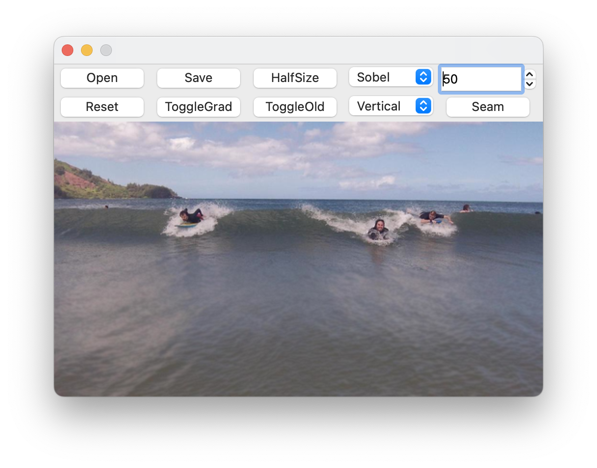

# The Visualization of Seam Carving Algorithm Using Qt5

## Intro

This is a simple implementation and visualization of Seam Carving algorithm using qt5.

Seam Carving is a content-aware image resizing technique where the image is reduced in size by one pixel of height (or width) at a time. The goal of seam carving is to find the lowest-energy vertical seam (or horizontal seam) and then to remove that seam from the image, thus reducing the image’s width (or height) by one pixel.

## Gui

## Usage

### PushButton

**Open/Save**: Open an image / Save the current result.
**HalfSize**: Resize the image to half of its original size. (from $m \times n$ to $\frac m2 \times \frac n2$)
**Seam**: Start the seam carving process.
**ToggleEg**: Toggle the energy map view.
**ToggleOld**: Toggle the original image for comparison.
**Reset**: Resume the image to the original size.

### SeamNum SpinBox
Set the number of seams to be removed (by **Seam** button).

### Direction ComboBox
[ *Vertical* | *Horizontal* ]
Choose the direction of the process of **Seam** button.

### Method ComboBox
[ *Forward* | *Sobel* | *Scharr* | *Prewitt* | *Roberts* | *Laplacian* ]
Choose the energy funtion in the energy map calculation (globally).

- *Forward* : Consider the cost of removing the seam rather than simply minimizing the gradient of the pixels.
- *Others* : Base on gradient magnitude

## Example

## Reference

[1] Avidan, Shai, and Ariel Shamir. "Seam carving for content-aware image resizing." ACM Transactions on Graphics (TOG) 26.3 (2007): 10.

[2] [https://github.com/insaneyilin/SeamCarving](https://github.com/insaneyilin/SeamCarving) 

[3] [https://andrewdcampbell.github.io/seam-carving](https://andrewdcampbell.github.io/seam-carving) 
